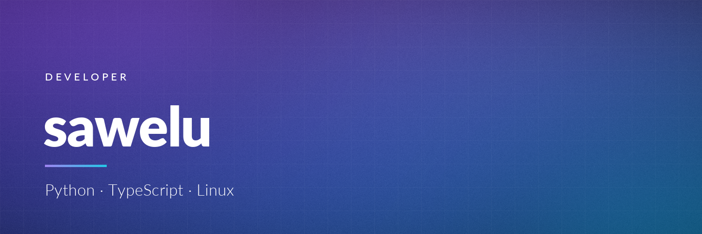

  

  <b>Системный администратор Linux · Docker · DevOps</b>

  
  
  

---

### Обо мне

Системный администратор Linux. Больше года практики: стажировка в Юргателекоме с работой
под руководством главных инженеров и ручное тестирование в ООО «НИИ».
Собираю шпаргалки и заметки по администрированию — по серверам, дистрибутивам и логам.
Ищу позицию системного администратора на полную занятость, работа дистанционная.

### Опыт

| Период | Место | Роль |
| --- | --- | --- |
| Янв — июн 2026 | Юргателеком, Юрга | Стажёр. Практика у главных инженеров компании |
| Авг — сен 2026 | ООО «НИИ», Москва | Junior QA Engineer, ручное тестирование |

### Навыки

  
  
  
  
  
  
  
  
  
  

Администрирование серверов Linux · Unix · сети и модель OSI · СУБД · Git

### Шпаргалки и заметки по Linux

| Репозиторий | О чём |
| --- | --- |
| [linux-server-cheatsheet](https://github.com/sawelu/linux-server-cheatsheet) | Подготовка, настройка и эксплуатация Linux-серверов |
| [logs-cheatsheet](https://github.com/sawelu/logs-cheatsheet) | Работа с логами: `grep`/`zgrep`, `journalctl`, веб- и почтовые логи, разбор OOM |
| [alt-linux](https://github.com/sawelu/alt-linux) · [arch](https://github.com/sawelu/arch) · [debian](https://github.com/sawelu/debian) · [fedora](https://github.com/sawelu/fedora) · [ubuntu](https://github.com/sawelu/ubuntu) | Подготовка, настройка и эксплуатация — по одному репозиторию на дистрибутив, в едином формате |

### Автоматизация и утилиты

| Репозиторий | О чём | Стек |
| --- | --- | --- |
| [site-security-scanner](https://github.com/sawelu/site-security-scanner) | Сканер сайтов и серверов: разведка, TLS и сертификат, порты и сервисы, уязвимости, оценка 0–100 | Python, Flask |
| [site-checker](https://github.com/sawelu/site-checker) | Проверка домена: DNS и NS, почта SPF/DKIM/DMARC, SSL, HTTP, пинг, порты, WHOIS | Python, Flask |
| [anti-stress](https://github.com/sawelu/anti-stress) | Мини-игры для релакса, pet-проект | TypeScript, React, Vite |
| `log-viewer` 🔒 | Просмотр и поиск по логам Linux: фильтры, live tail, статистика, экспорт | Python, Tkinter |

### Образование

- **ТУСУР** — Томский государственный университет систем управления и радиоэлектроники,
  факультет дистанционного обучения, «Квантовые и оптические системы связи». Высшее, в процессе, окончание ожидается в 2031
- **Юргинский технологический колледж им. Г. А. Павлючкова** — «Сетевое и системное администрирование», 2026

### Сертификаты

- 2026 — QA Manual Base
- 2025 — Наладчик технологического оборудования 2 (2-го) разряса, Юргинский технологический колледж
- 2024 — Веб-мастер. Веб-разработка на JavaScript

---

  Баннер и аватар сгенерированы скриптом <code>generate_assets.py</code> — лежит рядом

<!--
  ОПЦИЯ: блок статистики. Раскомментируй, только если развернёшь свой
  github-readme-stats (публичный vercel-инстанс часто отдаёт 429).

  
  

-->
